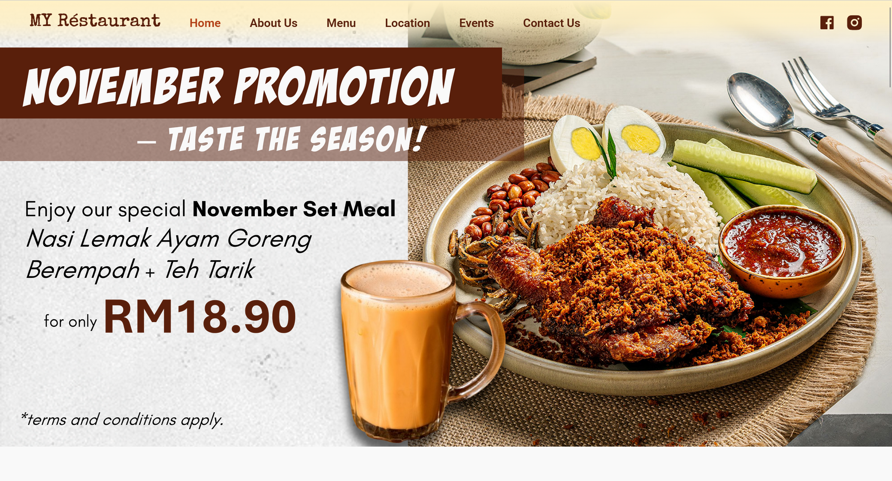
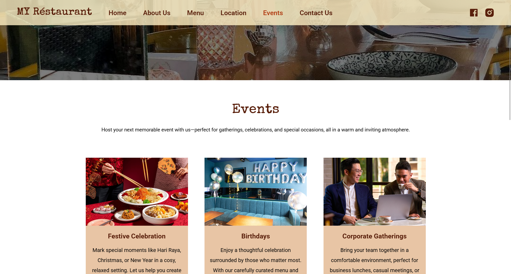
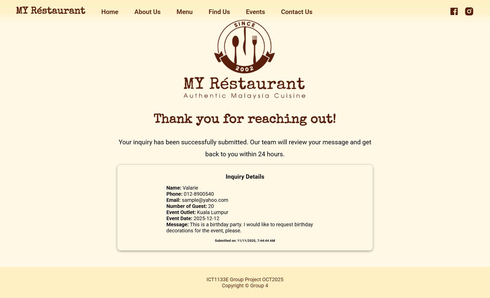
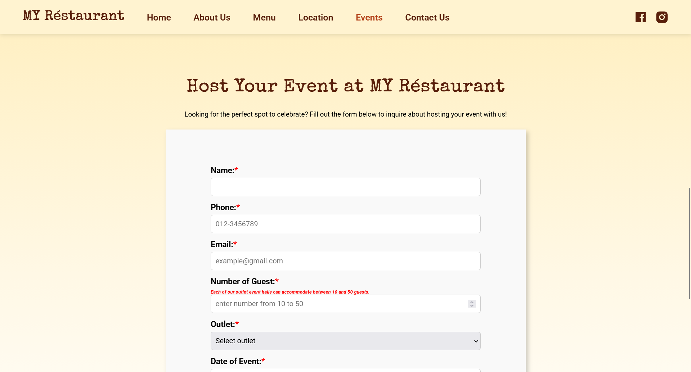
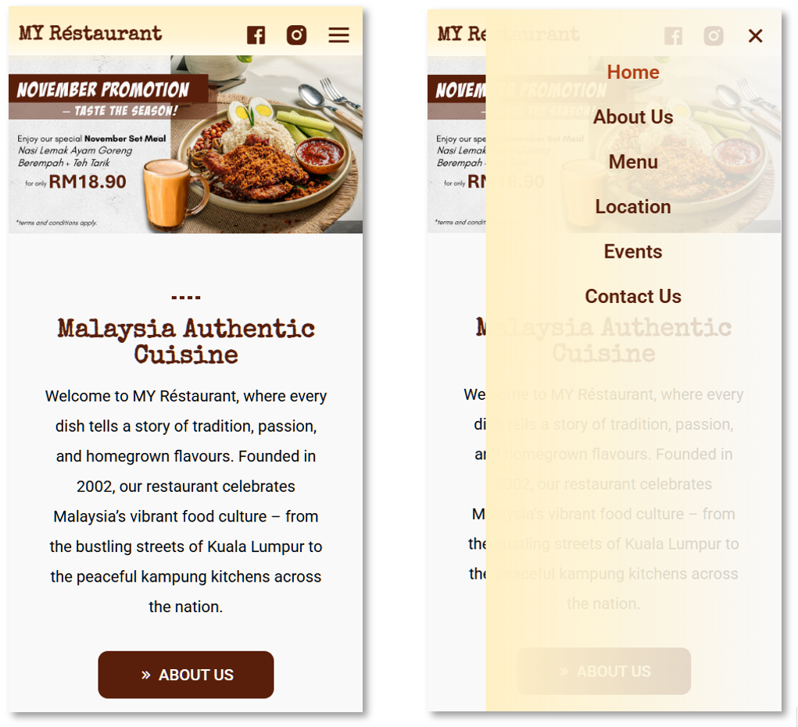

# My Restaurant Website
HTML | CSS | JavaScript | Responsive Web Design

This project is a multi-page restaurant website developed as part of a group assignment for the Web Design module.
The website introduces the restaurant, menu offerings, location information, and event hosting services. It also includes an online event inquiry form that allows users to submit booking requests.

---

## Live Demo
https://valarie-lim.github.io/my-restaurant/

---

## System Preview

---

## Project Overview

The goal of this project is to design and develop a responsive restaurant website that provides essential information for customers while offering an event inquiry function.

The website focuses on clear navigation structure, visual presentation, and responsive behavior across different screen sizes.

---

## My Role
This was a **group project**, and I served as the **group leader**.
My responsibilities included coordinating the project development, ensuring progress among team members, and maintaining consistency across the website.

### My Contributions
- Designed and developed the **Home Page**
- Designed and developed the **Events Page**
- Implemented the **Event Inquiry Form**
- Implemented **JavaScript form handling**
- Implemented **sessionStorage to store form data**
- Created the **Thank You page redirection**
- Implemented **responsive design for different screen sizes**
- Managed **navigation linking across all pages**
- Ensured consistent layout and navigation structure across the website

---

## Website Structure
The website consists of several pages:
- Home
- About Us
- Menu
- Location
- Events
- Contact Us
- Thank You Page

---

## Key Features
- Multi-page website structure
- Responsive design for desktop, tablet, and mobile devices
- Event inquiry form with input validation
- JavaScript form submission handling
- Session storage for temporary form data
- Automatic redirection to a Thank You page after form submission
- Interactive navigation menu
- External CSS stylesheet for consistent styling across pages
- Google Fonts integration for typography customization

---

## Technologies Used
- HTML
- CSS (External stylesheet)
- JavaScript
- Google Fonts (imported using external CSS)
- Boxicons
- Remix Icons

---

## Typography & Styling
Typography is implemented using **Google Fonts**, which are imported through an external CSS stylesheet to maintain consistent font styling across all pages.
The website uses a shared external CSS file to manage layout, colors, typography, and responsive behavior across the entire site.

---

## Form Handling Logic
The **Event Inquiry Form** uses JavaScript to handle form submission.

Key behaviors include:
- Form input validation
- Preventing default form submission
- Storing form data temporarily using `sessionStorage`
- Redirecting users to a **Thank You page** after successful submission

This improves user experience and demonstrates basic client-side form processing.

---

## Responsive Design
The website uses **CSS media queries** to adapt the layout for different screen sizes:
- Desktop
- Tablet
- Mobile devices

For smaller screens, the navigation menu switches to a **burger menu layout** to improve usability.

---

## What I Learned
Through this project, I gained practical experience in:
- Structuring multi-page websites
- Implementing responsive web design
- Handling form validation using JavaScript
- Using browser storage (`sessionStorage`)
- Managing navigation and page linking
- Collaborating and coordinating development in a group project

---

## Author
Valarie Lim  
Diploma in Information Technology
